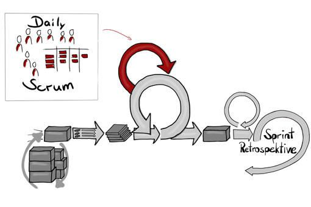

Das Daily Scrum ist ein 15-minütiges Meeting für das Scrum Team. Es findet an jedem Arbeitstag statt, im Normalfall zur gleichen Zeit am gleichen Ort. Das Treffen dient dem Team dazu, die Tätigkeiten im Zeitraum bis zum nächsten Daily Scrum zu teilen, zu planen und mögliche Hindernisse ("Impediments") im Team zu kommunizieren, um notwendige Aktionen möglichst sofort einzuleiten. Daily Scrum zählt wie Sprint Planning, Sprint Review und Sprint Retrospektive zu den Scrum Events.

# Herkunft

Das Daily Scrum wurde erstmalig im Scrum Guide beschrieben. Scrum wurde in den frühen 1990er Jahren durch Ken Sutherland und Ken Schwaber erdacht (veröffentlicht unter dem Namen: "SCRUM Software Development Process"). Die Ausarbeitung der Idee basiert auf der Publikation "New New Product Development Game", in der Hirotaka Takeuchi und Ikujiro Nonaka 1986 die Entwicklung eines gemeinsamen Ziels durch Iterationen beschrieben. Besondere Schwerpunkte waren hierbei Geschwindigkeit und Flexibilität. Die aktuell gültige Version von Scrum ist im sogenannten "Scrum Guide" dokumentiert, der in mehreren Sprachen frei zum Download auf der Website www.scrumguides.org zur Verfügung steht.

# Vorteile von SCRUM

* Die teilnehmenden Personen bleiben durch den straffen, 15-minütigem Ablauf konzentriert und schweifen nicht ab.
* Die Behandlung aktueller Themen ermöglicht eine fokussierte Planung kurzer Zeiträume (i.d.R. 1 Tag).
* Das einfache Regelwerk des Daily Scrums ermöglicht es einem stabilen Teilnehmerkreis, sich auch ohne Moderation weitgehend selbst zu organisieren.
* Das Team ist über den aktuellen Forschritt bezüglich des Sprint-Zieles informiert.
* Fachliche Rückfragen wurden im Team geklärt, bzw. die Klärung wurde eingeleitet. 

# Qualifizierung

Das Team muss mit den Regeln von Daily Scrum vertraut sein. Vor der ersten Durchführung eines Daily Scrums empfiehlt sich deshalb, das Team vorab kurz in die Methodik einzuführen. Die moderierende Person muss Erfahrungen zum Ablauf eines Daily Scrums und zu Timeboxing haben. Im Normalfall erklärt und moderiert der Scrum Master das Daily Scrum. Auf Wunsch oder bei Bedarf kann auch das Team die Moderation übernehmen.

# Rollenbeschreibung

Jedes Mitglied sollte genau über seine jeweilige Aufgabe im Team bescheid wissen!

| Rolle  | Beschreibung |
| ------------- | ------------- |
| Scrum Master  | Die Seele des Prozesses, die dafür sorgt, dass alle Regeln eingehalten werden.  |
| Product Owner | Auftraggeber, der die Anforderungen stellt und die spätere Umsetzung seiner Wünsche im Hinblick auf Funktionalität, Benutzbarkeit, Performanz und Qualität beurteilt.  |
| Team          | Für die Umsetzung der Anforderungen zuständig  |

## Das muss jeder drauf haben

* Alle teilnehmenden Personen sind in der Lage, ihre letzten und folgenden Tätigkeiten zur Erreichung des Sprint-Zieles mitzuteilen. Ggf. sind hierfür geeignete Tools zur Dokumentation einzusetzen.
* Alle sind über das aktuelle Sprint-Ziel informiert und fachlich in der Lage, die Relevanz der eigenen aktuellen Tätigkeiten in das Sprint-Ziel einzuordnen. Das unterstützt die Fokussierung auf relevante Themen.
* Das Team erscheint pünktlich zum Daily Scrum. Das Daily Scrum startet exakt zur vereinbarten Uhrzeit und endet spätestens 15 Minuten danach.
* Falls erforderlich sind technische oder organisatorische Vorbereitungen (z.B. Platz freiräumen, Boards aktualisieren, Beamer anschalten) vor dem Start des Daily Scrum abzuschließen, so dass der pünktliche Start des Daily-Scrum nicht gefährdet ist.

# Grenzen, Risiken und Nachteile

* Tiefes Eintauchen in eine fachliche Thematik ist aufgrund der kurzen Dauer des Daily Scrums nicht möglich. Daily Scrum dient dazu, den Bedarf eines intensiveren Austauschs zu erkennen. Der vertiefte, fachliche Austausch findet dagegen nach dem Daily Scrum statt. In der Regel sind dabei nur die betroffenen Personen beteiligt.
* Um die vorgesehene Zeit von 15 Minuten einzuhalten, benötigen alle teilnehmenden Personen eine hohe Disziplin bzgl. Pünktlichkeit und Einhaltung der einfachen Gesprächsregeln.
* Nachholtermine oder Wiederholungen der Inhalte für Personen, die später erscheinen, sind nicht vorgesehen.
* Ein Daily Scrum verhindert nicht die Schwierigkeiten räumlicher Trennung oder unterschiedlicher Zeitzonen. Alle Personen müssen zu einem festen Zeitpunkt an diesem Meeting teilnehmen.

# Siehe auch

* Verlinkungen zu angrenzenden Themen
* [Link auf diese Seite]({Projekt}.md)

# Weiterführende Literatur

* Weiterfuehrende Literatur zum Thema z.B. Bücher, Webseiten, Blogs, Videos, Wissenschaftliche Literatur, ...

# Quellen

[^1]: Quellen die ihr im Text verwendet habt z.B. Bücher, Webseiten, Blogs, Videos, Wissenschaftliche Literatur, ... (eine Quelle in eine Zeile, keine Zeilenumbrüche machen)
[^2]: [A Guide to the Project Management Body of Knowledge (PMBOK® Guide)](https://www.pmi.org/pmbok-guide-standards/foundational/PMBOK)
[^3]: [Basic Formatting Syntax for GitHub flavored Markdown](https://docs.github.com/en/github/writing-on-github/getting-started-with-writing-and-formatting-on-github/basic-writing-and-formatting-syntax)
[^4]: [Advanced Formatting Syntax for GitHub flavored Markdown](https://docs.github.com/en/github/writing-on-github/working-with-advanced-formatting/organizing-information-with-tables)

